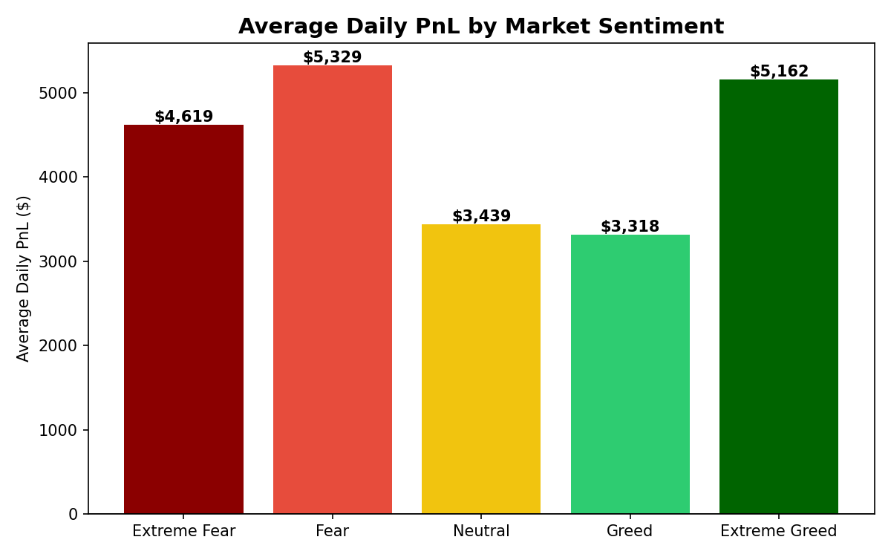
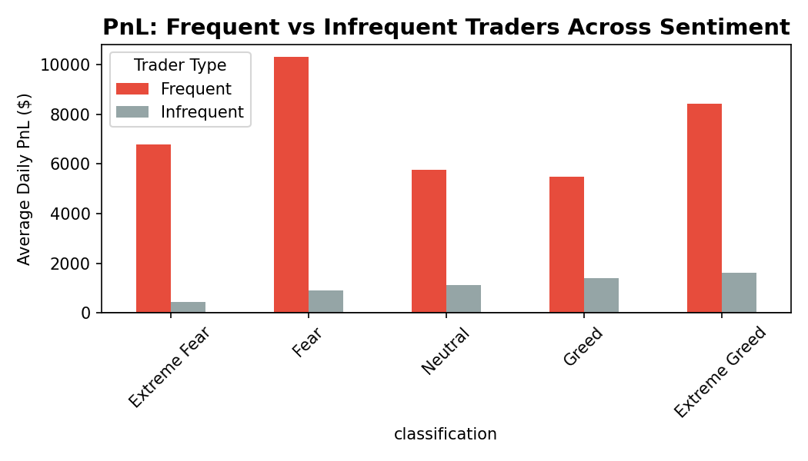
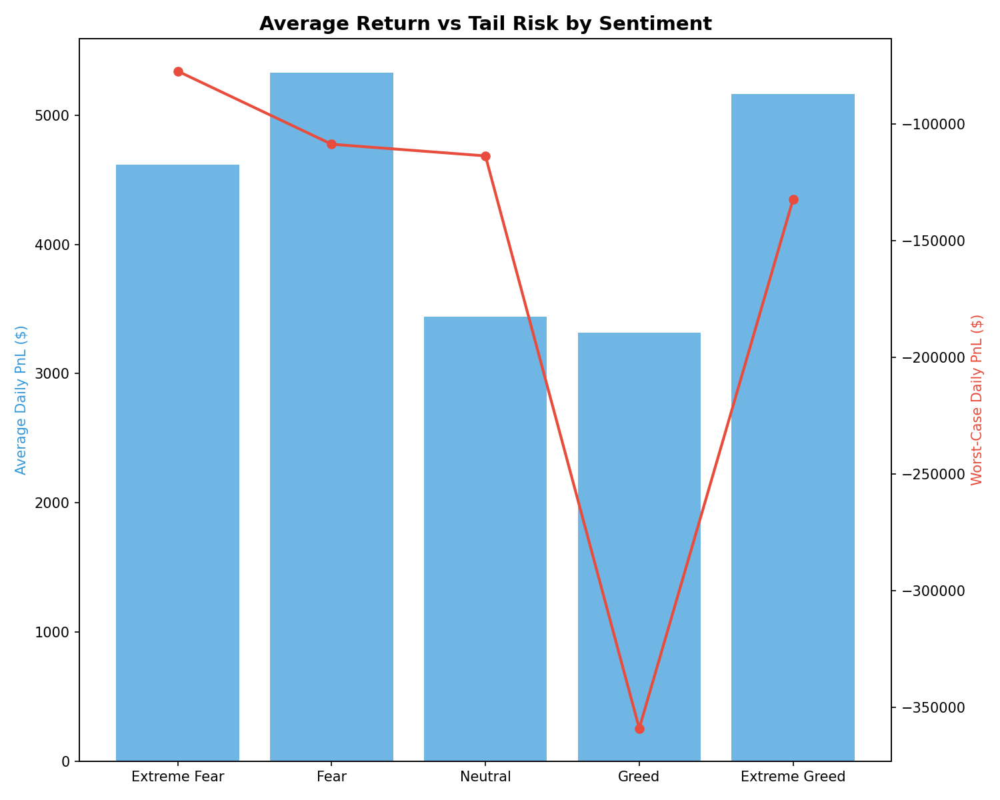

# Trader Performance vs Market Sentiment Analysis
## Objective
Analyzed how Bitcoin market sentiment (Fear/Greed) relates to trader 
behavior and performance on Hyperliquid, uncovering patterns for 
smarter trading strategies.

## Datasets
1. Bitcoin Fear/Greed Index (Date, Classification)  - https://drive.google.com/file/d/1PgQC0tO8XN-wqkNyghWc_-mnrYv_nhSf/view?usp=sharing
2. Hyperliquid Historical Trader Data (2,300+ trader-day records) - https://drive.google.com/file/d/1IAfLZwu6rJzyWKgBToqwSmmVYU6VbjVs/view?usp=sharing

## Key Charts

### Average PnL by Market Sentiment

### Frequent vs Infrequent Traders

### Average Return vs Tail Risk

## Methodology
- Cleaned and merged both datasets by aligning timestamps to daily level
- Engineered metrics: daily PnL, win rate, trade frequency, drawdown, 
  exposure proxy (Start Position)
- Segmented traders by leverage exposure, trading frequency, and 
  consistency

## Key Insights
1. Fear days showed higher average PnL (5,329) than Greed days (3,318), 
   contrary to common assumptions
2. Greed days carried the highest tail risk (min PnL of -358,963) 
   despite looking safer on average
3. Trade frequency was the strongest predictor of profitability across 
   all sentiment regimes — frequent traders outperformed infrequent 
   traders by 5-10x in every category
4. Traders showed contrarian long/short bias — more short-selling 
   during Extreme Greed than Extreme Fear

## Strategy Recommendations

**Strategy 1: Don't reduce trading activity during Fear**
Frequent traders earned 5-10x more than infrequent traders in every 
sentiment condition. Traders should keep trading normally during Fear 
days instead of pulling back — staying inactive hurts performance more 
than market sentiment itself does.

**Strategy 2: Set a hard position-size limit during Greed days**
Greed days looked safe on average but had the worst single-day loss of 
all categories. A strict cap on position size should be applied during 
Greed/Extreme Greed periods, even though average returns look fine.

## How to Run
1. Open `notebook.ipynb` in Google Colab or Jupyter
2. Install dependencies: `pip install pandas numpy matplotlib seaborn`
3. Upload the two CSV datasets
4. Run cells sequentially

## Tools Used
Python, Pandas, NumPy, Matplotlib, Seaborn
